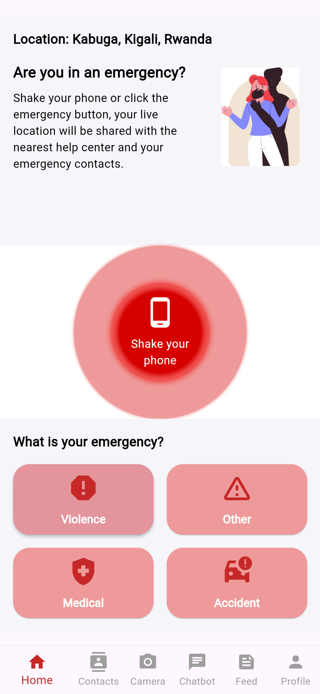
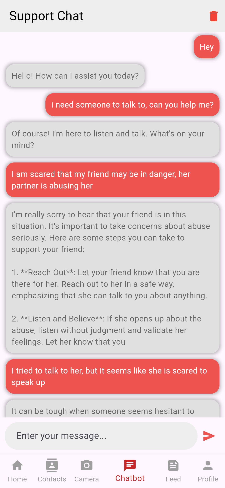

# Strong Sister App

Strong Sister Logo  


## Table of Contents
- [Project Overview](#project-overview)
- [Features](#features)
- [Technology Stack](#technology-stack)
- [Installation](#installation)
- [Usage](#usage)
- [Screenshots](#screenshots)
- [API Documentation](#api-documentation)
- [Contributing](#contributing)
- [License](#license)
- [Contact](#contact)

## Project Overview
The **Strong Sister** app is designed to be a supportive platform for women to share their experiences and access resources anonymously. It features an AI-powered chatbot that provides empathetic, personalized support, listening to users' needs and guiding them with tailored resources.

## Features
- **User Authentication:** Secure registration and login system using Firebase Authentication.
- **Safe Contacts:** Users can save and contact their safe contacts directly from the app.
- **Anonymous Posting:** Users can create, like, and comment on posts anonymously.
- **AI Chatbot:** An AI-powered chatbot offering emotional support and guidance.

## Technology Stack
- **Frontend:** Flutter/Dart
- **Backend:** Firebase for Authentication and Firestore for Data Storage
- **AI Model:** GPT-3.5 Turbo (or any other AI model)
- **APIs:** Custom API for chatbot integration

## Installation
To get a local copy up and running, follow these steps:

### Prerequisites
- [Flutter](https://flutter.dev/docs/get-started/install) installed on your machine.
- Firebase account setup.

### Steps
1. **Clone the Repository**
   ```bash
   git clone https://github.com/yourusername/strong_sister-app.git

2. **Navigate to the Project Directory**
    cd strongsisterapp
    cd strong_sister

3. **Install Dependencies**
    flutter pub get

4. **Set UP Firebase**
    - Follow the Firebase setup guide to add your app to Firebase
    - Update the `.env` file with your Firebase credentials

5. **Run the App**
    flutter run

## Usage
After installing, you can use the app for the following:
(Completed)
- User Registration and Login: Sign up with your email or log in if you already have an account.
- Save Safe Contacts: Add contacts who can be reached in emergencies.
(In Progress)
- Create Anonymous Posts: Share your thoughts anonymously and engage with the community.
- Chat with AI: Use the AI-powered chatbot for emotional support.
(Coming Soon)
- Emergency Report: 
- Incident Recording: Secure documentation of abuse proofs, including photos and videos
- Free Resources: Safety Information(articles...)

## Screenshots
(Production Still in Progress)

Welcome  
  

Login  
  

Home Page  
  

Safe Contacts  
  

AI ChatBot  
  

Community Feed  
  

Profile Management  
  


## Authors
Erica-Livia Ingabire [LinkedIn](www.linkedin.com/in/erica-livia), [Github](https://github.com/Erica-Livia/)  
Noella Polie Vicia Ishemezwe  [LinkedIn](https://www.linkedin.com/in/ishemezwe-polie-954022211/), [Github](https://github.com/Vicia0)  


## Strong Sister Team & Contact
Erica-Livia Ingabire  [LinkedIn](www.linkedin.com/in/erica-livia)  
Noella Polie Vicia Ishemezwe  [LinkedIn](https://www.linkedin.com/in/ishemezwe-polie-954022211/)  
Nelly Gloria Ndikumana  [LinkedIn](https://www.linkedin.com/in/nelly-gloria-ndikumana-b32331241/)  
Yvette Uwimana  [LinkedIn](https://www.linkedin.com/in/yvetteuwimana/)  


